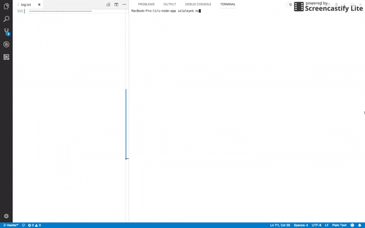

# LIRI - Node Application
LIRI is a command line node app that takes in parameters and gives back data. LIRI is like the iPhone's SIRI. However, while SIRI is a Speech Interpretation and Recognition Interface, LIRI is a Language Interpretation and Recognition Interface. LIRI accesses information from the Twitter, Spotify and OMDB APIs.

LIRI is able to take in the following commands:
* `my-tweets`
* `spotify-this-song`
* `movie-this`
* `do-what-it-says`

#

### How to input commands:

#### > `node liri.js my-tweets`

* LIRI will show the last 20 tweets from a programming themed twitter account and when the tweets were created at in your terminal/bash window.

#### > `node liri.js spotify-this-song '<song name here>'`

* _i.e. `node liri.js spotify-this-song 'Thriller'`_
    * LIRI will show the following information about the song in your terminal/bash window:

        * _The artist(s)_
        * _The song's name_
        * _The name of the album_
        * _A preview link of the song from Spotify_

#### > `node liri.js movie-this '<movie name here>'`

* _i.e. `node liri.js movie-this 'Mad Money'`_
    * LIRI will output the following information to your terminal/bash window:

        * _The title of the movie_
        * _The year the movie came out_
        * _The actors in the movie_
        * _The IMDB Rating of the movie_
        * _The Rotten Tomatoes Rating of the movie_
        * _The country where the movie was produced_
        * _The language of the movie_
        * _A plot summary of the movie_

#### > `node liri.js do-what-it-says`

* LIRI will output a random command to your terminal/bash window

#

### > __Demo Video:__

